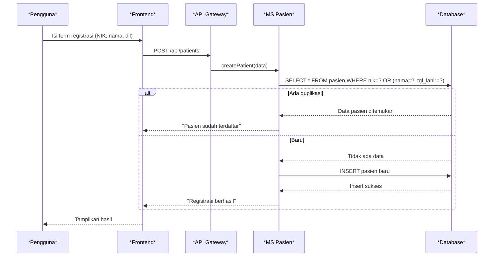
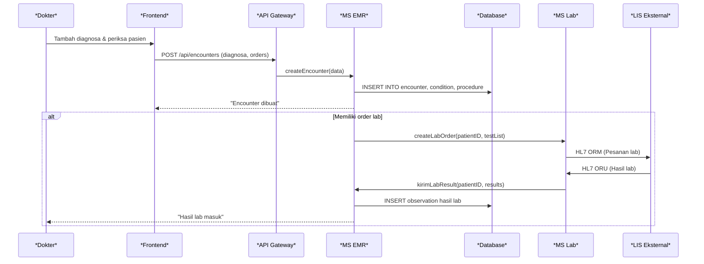
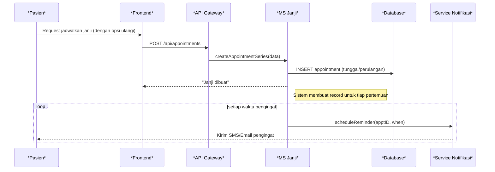

# Ringkasan Eksekutif

Dokumen ini menyajikan arsitektur mikroservis terperinci untuk **Modul Manajemen Pasien** pada Sistem Informasi Rumah Sakit (HIS). Arsitektur dirancang berlapis: komponen *frontend* (web/portal/mobile), *API Gateway* dengan layanan autentikasi (OAuth2/OIDC), sejumlah mikroservis domain (Pasien, EMR, Janji Temu, Lab, Farmasi, Billing), serta *backend* terpadu (FHIR Server, Terminology Server, basis data, cache, message broker). Diagram arsitektur (berikut) juga menampilkan integrasi dengan sistem eksternal (LIS/PACS, BPJS, payment gateway) dan infrastruktur pendukung (monitoring, audit log, backup, KMS/HSM). Setiap komponen dirancang dengan tanggung jawab spesifik, mendukung penggunaan standar kesehatan (HL7 FHIR, ICD) untuk memastikan interoperabilitas【31†L56-L64】【30†L156-L160】.

graph LR
    subgraph PublicZone [Zona Publik]
        direction LR
        Web[Web Portal Pasien] 
        Mobile[Mobile App] 
        Portal[Portal RS (Frontdesk)]
        LB[Load Balancer]
        WAF[WAF/Firewall]
        LB --> WAF
        WAF --> API[API Gateway + Auth Service]
    end
    subgraph PrivateZone [Zona Privat – Backend]
        direction TB
        API --> Auth[Identity Provider (Keycloak/OIDC)]
        API --> Pasien[Microservice Pasien]
        API --> EMR[Microservice EMR]
        API --> Janji[Microservice Janji Temu]
        API --> Lab[Microservice Lab]
        API --> Farmasi[Microservice Farmasi]
        API --> Billing[Microservice Billing]
        Pasien -->|REST/FHIR| FHIR[FHIR Server (Storage)]
        EMR -->|REST/FHIR| FHIR
        Janji -->|REST/FHIR| FHIR
        Lab -->|REST/FHIR| FHIR
        Farmasi -->|REST/FHIR| FHIR
        Billing -->|REST/FHIR| FHIR
        FHIR --> DB[Relational DB (Master-Replica)]
        FHIR --> Cache[Cache Redis]
        Pasien --> MQ[Message Broker (RabbitMQ/Kafka)]
        Janji --> MQ
        Billing --> MQ
        FHIR --> Terminology[Terminology Server (SNOMED/ICD)]
        Auth --> KMS[HSM/KMS]
        subgraph Infrastructure [Infrastruktur Pendukung]
            direction LR
            Monitor[Prometheus/Grafana]
            SIEM[SIEM/Log/Audit Store]
            Backup[Backup/DR Storage]
            KMS -->|kunci| FHIR
            KMS -->|kunci| DB
            EMR --> Monitor
            API --> SIEM
            DB --> SIEM
            DB --> Backup
        end
    end
    subgraph External [Sistem Eksternal]
        direction LR
        LIS[LIS (Laboratorium)]
        PACS[PACS (Radiologi)]
        BPJS[BPJS/SatuSehat]
        Payment[Payment Gateway]
        Lab --> LIS
        EMR --> PACS
        Billing --> BPJS
        Billing --> Payment
    end
    %% Anotasi Multi-Zone HA
    note over DB: DB disediakan master-replica dengan HA multi-zone
    note over Pasien,EMR,Janji: Setiap layanan dapat direplikasi (HA K8s)
```

Diagram di atas menunjukkan **zonasi jaringan** (PublicZone vs PrivateZone). Komponen frontend (portal) berada di DMZ publik, diakses melalui *Load Balancer* dan *WAF*. *API Gateway* (tersedia secara publik) meneruskan permintaan ke mikroservis di zona privat. Setiap mikroservis (Pasien, EMR, Janji, Lab, Farmasi, Billing) dikembangkan terpisah dan skala horizontal, berkomunikasi melalui REST/FHIR atau pesan. *FHIR Server* adalah penyimpanan data sentral (mendukung resources HL7 FHIR); ia mengelola data pasien, encounter, observasi, dll. *Terminology Server* menyediakan layanan terminologi medis (SNOMED, LOINC, ICD) untuk validasi kode【30†L156-L160】. *Relational DB* (master-replica) menyimpan data penting (Pasien, Encounter, Appointment, Claim) dengan replikasi zonal. *Cache Redis* menyimpan data sementara sering akses (misalnya jadwal dokter) untuk performa. *Message Broker* (RabbitMQ/Kafka) menangani antrian tugas/asinkron (misal notifikasi, sinkronisasi). 

**Gateway/API & Auth Service:** Menyediakan satu titik masuk API (ingress) dengan penerapan OAuth2/OIDC. Gateway meneruskan permintaan ke layanan backend yang sesuai. *Auth Service* (Keycloak) mengelola autentikasi pengguna, token OIDC/JWT, dan MFA. Ia terintegrasi dengan LDAP/AD rumah sakit untuk manajemen user.  
**Frontend:** Antarmuka pengguna (web/mobile) bagi pasien, staf frontdesk, dan tenaga medis. Berkomunikasi ke gateway untuk operasi (registrasi, jadwal, EMR).  
**Microservice Pasien:** Menangani CRUD data pasien. Validasi duplikasi (menggunakan NIK, nama, tanggal lahir). Berkomunikasi dengan DB untuk simpan/panggil data pasien.  
**Microservice EMR:** Mengelola encounter/rekam medis. Merekam diagnosa (ICD), tindakan, hasil lab, resep, catatan SOAP. Berinteraksi dengan FHIR Server untuk simpan resource `Encounter`, `Condition`, `Observation`, dsb.  
**Microservice Janji Temu:** Pengaturan booking janji pasien-dokter, dukung multi-slot dan recurring. Mengakses DB jadwal, membuat notifikasi (melalui Message Broker). Memastikan tidak ada double booking.  
**Microservice Lab:** Proses permintaan dan hasil laboratorium. Mengirim pesanan ke LIS eksternal via HL7/FHIR dan menerima hasilnya. Menyimpan hasil ke database (FHIR `Observation`).  
**Microservice Farmasi:** Menangani resep dan stok obat. Menerima `MedicationRequest` dari EMR, mengelola inventory, dan mencatat `MedicationDispense`. Mengintegrasi dengan eksternal (pesan ke apotek, pembaruan stok).  
**Microservice Billing:** Mengkalkulasi tagihan layanan. Mengumpulkan semua item biaya (visit, lab, obat), menghasilkan `Claim` FHIR. Integrasi dengan BPJS (SEP dan klaim) serta payment gateway untuk pembayaran.  
**FHIR Server:** Basis data utama yang memahami resource FHIR. Menyediakan REST API standar HL7 FHIR untuk semua data klinis. Resource FHIR memungkinkan interoperabilitas dan pemenuhan protokol SatuSehat【31†L56-L64】.  
**Terminology Server:** Menyediakan pelayanan kode medis (SNOMED CT, LOINC, ICD-10). Layanan lookup validasi kode. Penting untuk memastikan kode diagnosa/obat sesuai standar【30†L156-L160】.  
**Relational DB (Master-Replica):** Menyimpan data struktural dengan konsistensi tinggi (ACID). Master untuk penulisan, replica di zona lain untuk bacaan dan failover. Tabel utamanya: Patient, Encounter, Appointment, Claim, Observations.  
**Cache (Redis):** Menyimpan data akses tinggi seperti sesi user, antrian antrian sederhana, dan response caching (misalnya list dokter). Mempercepat respons tanpa membebani DB relasional.  
**Message Broker:** Mengelola komunikasi asynchronous (RabbitMQ/Kafka). Digunakan untuk notifikasi (email/SMS), sinkronisasi antrian, integrasi event-driven (misal pasien check-in trigger update statistik). Memastikan sistem terdistribusi.  
**Identity Provider (Keycloak/OIDC):** Platform otentikasi pusat. Mendukung OAuth2/OpenID Connect, Single Sign-On (SSO), dan MFA. Mengeluarkan token JWT untuk otorisasi mikroservis. Menyimpan role/permissions (RBAC).  
**External Systems:** Antarmuka ke sistem di luar rumah sakit. **LIS/PACS** menerima order lab/radiologi dan mengirim hasil kembali. **BPJS/SatuSehat** untuk registrasi SEP dan klaim billing (berbasis FHIR `CoverageEligibilityRequest`/`Claim`). **Payment Gateway** menerima pembayaran online pasien. Semua interaksi mengikuti standar (HL7 atau RESTful API).  
**Monitoring (Prometheus/Grafana):** Mengumpulkan metrik kinerja (CPU, latency) dan kesehatan layanan (uptime). Tampilan Grafana memantau layanan secara real-time. Menyediakan alert jika threshold terlampaui (misal latensi tinggi).  
**SIEM/Log/Audit Store:** Menyimpan log audit keamanan dan log aplikasi. SIEM menganalisis peristiwa keamanan (login gagal, percobaan injeksi). Sesuai HIPAA, log akses data pasien dicatat lengkap (user, waktu, tindakan).  
**Backup/DR Storage:** Penyimpanan terpisah untuk backup database. Backup dilakukan berkala (inkremental harian, full mingguan). Juga backup file penting (config, container images) di cloud atau off-site storage. Menjamin RPO (Recovery Point Objective) rendah.  
**HSM/KMS:** Hardware Security Module untuk manajemen kunci kriptografi. Menyimpan kunci enkripsi data (AES-256) terpisah dari server aplikasi. Mendukung rotasi kunci otomatis dan audit keamanan pada kunci.  

## Alur Data Kunci

Berikut skenario alur data utama dalam diagram beruntun mermaid:

### 1. Registrasi Pasien (Dengan Deteksi Duplikasi)  

Proses: pengguna (frontdesk) memasukkan data pasien baru. Frontend mengirim permintaan ke Gateway, diteruskan ke *microservice Pasien*. Layanan memeriksa duplikasi di DB (berdasarkan NIK atau kombinasi nama/tanggal lahir). Jika ada pasien cocok, notifikasi peringatan dikirim; jika tidak, pasien baru disimpan. Respons akhir dikembalikan ke UI.

### 2. Membuat Encounter/Update EMR (termasuk Order Lab)  

Proses: dokter menginput data kunjungan (encounter) via UI. Frontend mengirim ke *microservice EMR*, yang menyimpan data encounter dan diagnosa di DB. Jika ada permintaan laboratorium, EMR meneruskan order ke *microservice Lab*, yang mengirim pesan HL7 ke LIS. Setelah hasil lab tersedia, LIS mengirim pesan ke layanan Lab, lalu Lab mengupdate EMR dengan hasil lab. EMR mencatat hasil tersebut di DB dan memberi tahu dokter.

### 3. Penjadwalan Janji (Recurring + Notifikasi)  

Proses: pasien atau frontdesk membuat janji temu (bisa berulang). *Microservice Janji Temu* menerima permintaan dan menyimpan satu atau beberapa entri `Appointment` di DB (untuk janji berulang dibuat beberapa record). Sistem kemudian mengatur notifikasi pengingat via service notifikasi (terjadwal pada H-1). Ketika waktu tiba, notifikasi (SMS/email) dikirim ke pasien.

## Kontrol Keamanan di Arsitektur

Keamanan diterapkan berlapis pada arsitektur ini:  
- **Otentikasi & Autorisasi:** Pengguna dan layanan berkomunikasi melalui OAuth2/OIDC. Contoh alur: saat login, frontend redirect ke Keycloak, pengguna input kredensial, dan Keycloak mengeluarkan JWT. Setiap API request ke Gateway menyertakan token Bearer. Gateway dan layanan mikroservis memverifikasi token dan memastikan scope/role. MFA (misal SMS OTP) diaktifkan untuk akun administrasi.  
- **Enkripsi Transport (TLS):** Semua komunikasi antar komponen (frontend, API, mikroservis, DB) menggunakan HTTPS/TLS. Ini melindungi data in-transit sesuai HIPAA. IPSec atau VPN digunakan untuk jalur lintas pusat data jika diperlukan.  
- **Enkripsi Data At-Rest (AES-256):** Data sensitif di-disk (database) dienkripsi dengan AES-256. Kunci enkripsi disimpan di KMS/HSM terpisah. Dengan ini, meski media penyimpanan fisik tercuri, data tidak dapat didekripsi tanpa kunci【10†L137-L145】.  
- **Manajemen Kunci (KMS/HSM):** Kunci enkripsi disimpan dan dirotasi secara periodik di HSM/KMS (misal AWS KMS atau on-prem HSM). Akses ke kunci dikontrol ketat. Rotasi kunci menghasilkan minimal gangguan dan log audit.  
- **Audit Logging:** Setiap akses CRUD pada data pasien dicatat dengan detail (user, waktu, tindakan). Log disimpan di SIEM terpusat. Insiden (misal gagal login, perubahan hak akses) di-alert-kan ke tim keamanan. Penggunaan SIEM menjamin kepatuhan standar HIPAA/ISO.  
- **Network Segmentation:** Komponen internal (DB, mikroservis) ditempatkan di jaringan privat. Hanya API Gateway dan layanan monitoring/log yang diakses dari zona publik. Firewall internal memisahkan zona (misal VLAN berbeda).  
- **WAF dan IDS/IPS:** *Web Application Firewall (WAF)* diletakkan di depan API Gateway untuk memfilter serangan OWASP Top 10. Sistem IDS/IPS memonitor trafik abnormal (misal SQL injection).  
- **Prinsip Least Privilege:** Layanan mikroservis dan database hanya diberi hak minimal. Misalnya, layanan Billing tidak bisa membaca data rekam medis kecuali perlu. Otentikasi database menggunakan akun yang hanya bisa mengakses skema terkait.  

Dengan kombinasi kontrol ini, arsitektur memastikan data pasien selalu terlindungi baik saat transit maupun tersimpan【10†L137-L145】【12†L1371-L1380】.

## Rekomendasi Deployment dan Skalabilitas

- **Kubernetes & CI/CD:** Gunakan Kubernetes untuk orkestrasi container (Docker). Pisahkan namespace per lingkungan (dev, staging, prod). Deploy setiap mikroservis dengan Helm chart untuk konfigurasi konsisten. CI/CD pipeline (GitOps/Jenkins/GitLab) otomatisasi build, test, dan deploy.  
- **Namespace & Multi-Zone:** Jalankan cluster multi-zone (dua availability zone) untuk high availability. Misal namespace `pasien-system` untuk semua layanan patient mgmt. Gunakan readiness/liveness probe untuk restart otomatis jika gangguan.  
- **Skalabilitas:** Terapkan Horizontal Pod Autoscaler (HPA) berbasis penggunaan CPU/memori atau antrean. Tambah *read replicas* pada DB untuk penanganan beban baca tinggi. Gunakan Redis Cache terdistribusi untuk meringankan beban DB.  
- **Backup & Disaster Recovery:** Atur backup RPO harian (inkremental) dan RTO minimal 1-4 jam. Simpan backup di lokasi geografis berbeda. Gunakan PITR (point-in-time recovery) untuk database. Rencanakan DR drill periodik.  
- **Performansi:** Index kolom yang sering dicari (mrn, tanggal lahir, status janji). Gunakan query tuning (cache query frequently). Layanan kritis (registrasi, login) diprioritaskan autoscale.  

## Perbandingan Pilihan Deployment

| Opsi Deployment               | Keuntungan                                             | Kekurangan                                             |
|-------------------------------|--------------------------------------------------------|--------------------------------------------------------|
| **Kubernetes Cloud-Managed** (EKS/GKE/AKS) | - Pengelolaan infrastruktur oleh provider (patching, autoscaling)  <br> - Mudah skala cluster dan multi-AZ  <br> - Integrasi layanan cloud (KMS, monitoring)  | - Biaya berlangganan cloud  <br> - Ketergantungan pada vendor (vendor lock-in)  <br> - Kepatuhan khusus organisasi (data sovereignty) |
| **Kubernetes On-Prem**         | - Kontrol penuh atas hardware dan data (lokal)  <br> - Sesuai jika ada regulasi penyimpanan data di dalam negeri  <br> - Tidak ada biaya cloud setelah infrastruktur ada  | - Beban operasional tinggi (patching, monitoring in-house)  <br> - Skalabilitas fisik terbatas tanpa investasi HW tambahan  <br> - Butuh tim DevOps/IT lebih besar untuk maintenance |

**Tidak ditentukan:** Kebijakan *log retention*, spesifik jumlah POD per microservice, *Exact RPO/RTO*, dan provider cloud mana akan digunakan (AWS/GCP/Azure) disebut sebagai tidak ditentukan, karena bergantung kebutuhan instansi.

