# 1. Pendahuluan

## 1.1 Latar Belakang

Perkembangan teknologi informasi di bidang kesehatan mendorong rumah sakit untuk mengimplementasikan sistem digital yang mampu meningkatkan efisiensi operasional, kualitas pelayanan, serta keamanan data pasien. Sistem Informasi Rumah Sakit (SIR/HIS) hadir sebagai solusi terintegrasi untuk mengelola berbagai proses bisnis rumah sakit, mulai dari pendaftaran pasien, pengelolaan rekam medis, penjadwalan layanan, hingga pelaporan administrasi dan medis.

Modul Manajemen Pasien merupakan salah satu komponen utama dalam Sistem Informasi Rumah Sakit yang berfungsi untuk mendukung proses pengelolaan data pasien secara terpusat dan terintegrasi. Modul ini memungkinkan tenaga medis dan staf administrasi untuk melakukan pengelolaan data pasien dengan lebih cepat, akurat, dan aman.

Dokumen Technical Specification Document (TSD) ini disusun untuk memberikan spesifikasi teknis terkait pengembangan dan implementasi Modul Manajemen Pasien pada sistem SIR/HIS. Dokumen ini akan menjadi acuan bagi tim pengembang, analis sistem, penguji sistem, serta stakeholder terkait dalam memahami kebutuhan teknis dan alur kerja sistem yang akan dibangun.

---

## 1.2 Tujuan Dokumen

Dokumen Technical Specification Document (TSD) ini bertujuan untuk:

- Menjelaskan spesifikasi teknis Modul Manajemen Pasien pada Sistem Informasi Rumah Sakit (SIR/HIS).
- Mendefinisikan arsitektur sistem dan integrasi antar modul terkait.
- Menjelaskan alur proses bisnis dan interaksi pengguna dalam sistem.
- Mendokumentasikan kebutuhan fungsional dan non-fungsional sistem.
- Menjadi referensi bagi tim pengembang dalam proses implementasi, pengujian, dan pemeliharaan sistem.
- Memastikan sistem yang dikembangkan memenuhi aspek keamanan, privasi data, skalabilitas, dan kemudahan penggunaan.

---

## 1.3 Ruang Lingkup

Dokumen ini mencakup spesifikasi teknis untuk Modul Manajemen Pasien dalam Sistem Informasi Rumah Sakit, yang meliputi:

- Pengelolaan data pasien.
- Proses registrasi pasien baru dan pasien lama.
- Pengelolaan rekam medis pasien.
- Pengelolaan diagnosis, tindakan medis, resep, dan hasil laboratorium.
- Penjadwalan dan pengelolaan janji temu pasien.
- Pengaturan hak akses pengguna berdasarkan peran.
- Integrasi modul dengan layanan atau sistem lain dalam lingkungan SIR/HIS.
- Pengelolaan keamanan, privasi, dan audit data sistem.

Dokumen ini tidak mencakup detail implementasi infrastruktur fisik, konfigurasi perangkat keras, maupun spesifikasi detail modul di luar Manajemen Pasien.

---

## 1.4 Definisi dan Singkatan

| Istilah / Singkatan | Definisi |
|---|---|
| SIR/HIS | Sistem Informasi Rumah Sakit / Hospital Information System |
| TSD | Technical Specification Document |
| EMR | Electronic Medical Record |
| User | Pengguna sistem yang memiliki hak akses tertentu |
| Administrator | Pengguna dengan hak akses penuh untuk konfigurasi dan pengelolaan sistem |
| Rekam Medis | Data riwayat kesehatan pasien yang tersimpan dalam sistem |
| RBAC | Role Based Access Control |
| API | Application Programming Interface |
| Audit Log | Catatan aktivitas pengguna dalam sistem |
| Registrasi Pasien | Proses pendaftaran pasien ke dalam sistem rumah sakit |

# 2. Gambaran Umum Sistem

## 2.1 Deskripsi Sistem SIR/HIS

Sistem Informasi Rumah Sakit (SIR/HIS) merupakan platform terintegrasi yang digunakan untuk mendukung operasional dan layanan rumah sakit secara digital. Sistem ini dirancang untuk membantu pengelolaan data, proses administrasi, pelayanan medis, serta koordinasi antar unit dalam rumah sakit secara terpusat dan real-time.

Modul Manajemen Pasien menjadi salah satu modul inti dalam SIR/HIS yang berfungsi untuk mengelola seluruh informasi dan proses terkait pasien, mulai dari registrasi, penyimpanan rekam medis, penjadwalan layanan, hingga pengelolaan riwayat pemeriksaan pasien.

Sistem dirancang menggunakan pendekatan modular sehingga memungkinkan integrasi dengan modul lain seperti:

- Modul Rekam Medis Elektronik (EMR)
- Modul Rawat Jalan
- Modul Rawat Inap
- Modul Laboratorium
- Modul Farmasi
- Modul Billing dan Pembayaran
- Modul Pelaporan dan Dashboard

Dengan pendekatan tersebut, sistem dapat meningkatkan efisiensi operasional, meminimalkan duplikasi data, serta meningkatkan akurasi dan keamanan informasi pasien.

---

## 2.2 Modul Manajemen Pasien

Modul Manajemen Pasien bertanggung jawab dalam pengelolaan seluruh data dan aktivitas pasien pada rumah sakit. Modul ini menjadi pusat data pasien yang digunakan oleh berbagai unit pelayanan medis maupun administrasi.

Fungsi utama modul meliputi:

- Registrasi pasien baru dan pasien lama
- Pengelolaan data identitas pasien
- Pengelolaan nomor rekam medis
- Penyimpanan riwayat pemeriksaan pasien
- Pengelolaan jadwal dan janji temu
- Pengelolaan data diagnosis dan tindakan medis
- Pengelolaan rujukan pasien
- Integrasi dengan layanan laboratorium dan farmasi

Modul ini juga menyediakan fitur pencarian data pasien, validasi data, serta monitoring aktivitas pengguna untuk mendukung keamanan dan audit sistem.

---

## 2.3 Arsitektur Sistem

Sistem SIR/HIS menggunakan arsitektur berbasis client-server dan service-oriented architecture (SOA) untuk mendukung integrasi antar modul dan skalabilitas sistem.

Komponen utama arsitektur sistem terdiri dari:

- Frontend Application  
  Digunakan oleh pengguna seperti admin, dokter, perawat, dan petugas registrasi melalui web browser atau aplikasi internal rumah sakit.

- Backend Service  
  Menangani proses bisnis, validasi data, autentikasi pengguna, dan komunikasi antar modul sistem.

- Database Server  
  Menyimpan data pasien, rekam medis, jadwal pemeriksaan, transaksi, dan log aktivitas sistem.

- API Integration Layer  
  Digunakan untuk integrasi dengan sistem eksternal atau modul lain seperti laboratorium, farmasi, BPJS, dan sistem pembayaran.

- Security Layer  
  Mengelola autentikasi, otorisasi, enkripsi data, dan audit log sistem.

---

## 2.4 Alur Interaksi Sistem

Berikut gambaran umum alur interaksi dalam Modul Manajemen Pasien:

1. Petugas registrasi melakukan input atau pencarian data pasien.
2. Sistem memvalidasi data pasien dan membuat nomor rekam medis apabila pasien baru.
3. Dokter dan tenaga medis mengakses data pasien berdasarkan hak akses masing-masing.
4. Data pemeriksaan, diagnosis, tindakan medis, dan resep disimpan ke dalam sistem.
5. Sistem mengintegrasikan data dengan modul laboratorium, farmasi, dan billing.
6. Seluruh aktivitas pengguna dicatat ke dalam audit log sistem.

---

## 2.5 Diagram Arsitektur Sistem


| Layer / Komponen | Deskripsi |
|---|---|
| Client Layer | Layer yang digunakan pengguna untuk mengakses sistem SIR/HIS melalui Web Application, Mobile Application, Self Service Kiosk, Patient Portal, dan aplikasi pihak ketiga. |
| Web Application | Digunakan oleh administrator, dokter, perawat, dan staf rumah sakit untuk mengakses sistem melalui browser. |
| Mobile Application | Digunakan tenaga medis untuk mengakses data pasien dan layanan medis melalui perangkat mobile. |
| Self Service Kiosk | Digunakan pasien untuk melakukan registrasi mandiri dan pengambilan antrean. |
| Patient Portal | Digunakan pasien untuk melihat jadwal, hasil pemeriksaan, riwayat layanan, dan informasi kesehatan lainnya. |
| API Gateway | Berfungsi sebagai pintu utama komunikasi antara client dan backend service. Menangani authentication, authorization, routing, logging, rate limiting, dan monitoring request. |
| Patient Management Service | Mengelola data pasien seperti registrasi pasien, data demografi, identitas pasien, dan informasi asuransi. |
| Appointment Service | Mengelola penjadwalan janji temu pasien, reschedule jadwal, pembatalan jadwal, dan antrean pemeriksaan. |
| Medical Record Service (EMR) | Mengelola rekam medis elektronik pasien seperti diagnosis, riwayat pemeriksaan, tindakan medis, dan SOAP note. |
| Clinical Service | Menangani aktivitas klinis seperti pencatatan vital sign, order laboratorium, radiologi, dan resep obat. |
| Billing Service | Mengelola transaksi pembayaran, invoice pasien, tarif layanan, dan klaim asuransi. |
| Notification Service | Mengirimkan notifikasi sistem melalui Email, SMS, WhatsApp, dan Push Notification. |
| User & Access Service | Mengelola user, role, permission, audit log, dan session management sistem. |
| Database Layer | Menyimpan seluruh data operasional sistem seperti data pasien, jadwal, rekam medis, billing, dan data pengguna. |
| Patient Database | Menyimpan data identitas dan informasi pasien. |
| EMR Database | Menyimpan rekam medis elektronik pasien. |
| Billing Database | Menyimpan data transaksi dan pembayaran pasien. |
| File Storage | Menyimpan dokumen pendukung seperti hasil pemeriksaan, file laboratorium, dan dokumen pasien. |
| PACS / Object Storage | Menyimpan citra medis dan file radiologi berukuran besar. |
| Integration Layer | Menghubungkan sistem dengan layanan eksternal menggunakan REST API, HL7, dan FHIR. |
| BPJS Integration | Mendukung integrasi layanan SEP, klaim, dan verifikasi peserta BPJS. |
| SATUSEHAT Integration | Mendukung pertukaran data kesehatan nasional dengan platform SATUSEHAT. |
| LIS / PACS Integration | Integrasi dengan sistem laboratorium dan radiologi rumah sakit. |
| Infrastructure Layer | Menyediakan infrastruktur untuk deployment, scaling, dan availability sistem. |
| Load Balancer | Membagi traffic sistem agar performa tetap stabil. |
| Container Platform | Menggunakan Docker dan Kubernetes untuk deployment service secara terisolasi dan scalable. |
| Cache Server | Menggunakan Redis untuk meningkatkan performa akses data. |
| Message Queue | Menggunakan RabbitMQ atau Kafka untuk komunikasi asynchronous antar service. |
| Security Layer | Menyediakan keamanan sistem melalui authentication, authorization, encryption, firewall, dan audit log. |
| Authentication & Authorization | Menggunakan OAuth2, JWT, dan RBAC untuk pengelolaan hak akses pengguna. |
| Audit Log | Mencatat seluruh aktivitas pengguna untuk kebutuhan monitoring dan keamanan sistem. |
| Monitoring & Logging | Melakukan monitoring performa sistem, logging aplikasi, dan alerting apabila terjadi gangguan. |
| Backup & Disaster Recovery | Menyediakan mekanisme backup data dan recovery sistem untuk menjaga ketersediaan layanan. |

# 3. Peran Pengguna dan Hak Akses

## 3.1 Deskripsi Umum

Sistem Informasi Rumah Sakit (SIR/HIS) menerapkan mekanisme Role Based Access Control (RBAC) untuk mengatur hak akses pengguna berdasarkan peran dan tanggung jawab masing-masing. Setiap pengguna hanya dapat mengakses fitur dan data sesuai dengan kewenangan yang diberikan oleh sistem.

Penerapan hak akses bertujuan untuk:

- Menjaga keamanan dan kerahasiaan data pasien.
- Membatasi akses terhadap informasi sensitif.
- Memastikan aktivitas pengguna sesuai dengan tugas dan tanggung jawabnya.
- Mendukung audit dan monitoring aktivitas sistem.

---

## 3.2 Peran Pengguna

Berikut adalah daftar peran pengguna utama dalam sistem SIR/HIS:

| Peran Pengguna | Deskripsi |
|---|---|
| Administrator | Mengelola konfigurasi sistem, data master, user management, dan monitoring sistem. |
| Petugas Registrasi | Melakukan pendaftaran pasien, verifikasi data pasien, dan pengelolaan antrean. |
| Dokter | Mengakses rekam medis pasien, melakukan diagnosis, tindakan medis, dan pengisian catatan medis. |
| Perawat | Membantu proses pelayanan medis seperti input vital sign, monitoring pasien, dan tindakan keperawatan. |
| Petugas Laboratorium | Mengelola pemeriksaan laboratorium dan input hasil pemeriksaan pasien. |
| Apoteker | Mengelola resep obat dan distribusi obat pasien. |
| Kasir / Billing Staff | Mengelola transaksi pembayaran, invoice, dan klaim pasien. |
| Pasien | Mengakses portal pasien untuk melihat jadwal, hasil pemeriksaan, dan riwayat layanan kesehatan. |

---

## 3.3 Hak Akses Pengguna

### 3.3.1 Administrator

| Fitur / Modul | Hak Akses |
|---|---|
| User Management | Create, Read, Update, Delete |
| Role & Permission | Create, Read, Update, Delete |
| Master Data | Create, Read, Update, Delete |
| Monitoring Sistem | Read |
| Audit Log | Read |
| Konfigurasi Sistem | Create, Read, Update |

---

### 3.3.2 Petugas Registrasi

| Fitur / Modul | Hak Akses |
|---|---|
| Registrasi Pasien | Create, Read, Update |
| Data Pasien | Read, Update |
| Jadwal Pemeriksaan | Create, Read, Update |
| Antrean Pasien | Read, Update |
| Rekam Medis | Read (Terbatas) |

---

### 3.3.3 Dokter

| Fitur / Modul | Hak Akses |
|---|---|
| Data Pasien | Read |
| Rekam Medis | Create, Read, Update |
| Diagnosis | Create, Read, Update |
| Tindakan Medis | Create, Read, Update |
| Resep Obat | Create, Read |
| Hasil Laboratorium | Read |
| Jadwal Pemeriksaan | Read |

---

### 3.3.4 Perawat

| Fitur / Modul | Hak Akses |
|---|---|
| Data Pasien | Read |
| Rekam Medis | Read |
| Vital Sign | Create, Read, Update |
| Tindakan Keperawatan | Create, Read, Update |
| Jadwal Pemeriksaan | Read |

---

### 3.3.5 Petugas Laboratorium

| Fitur / Modul | Hak Akses |
|---|---|
| Order Laboratorium | Read |
| Hasil Pemeriksaan | Create, Read, Update |
| Data Pasien | Read |

---

### 3.3.6 Apoteker

| Fitur / Modul | Hak Akses |
|---|---|
| Resep Obat | Read |
| Pengelolaan Obat | Create, Read, Update |
| Distribusi Obat | Create, Read, Update |
| Data Pasien | Read |

---

### 3.3.7 Kasir / Billing Staff

| Fitur / Modul | Hak Akses |
|---|---|
| Invoice Pasien | Create, Read, Update |
| Pembayaran | Create, Read |
| Klaim Asuransi | Create, Read, Update |
| Data Pasien | Read |

---

### 3.3.8 Pasien

| Fitur / Modul | Hak Akses |
|---|---|
| Profil Pasien | Read |
| Jadwal Pemeriksaan | Read |
| Riwayat Pemeriksaan | Read |
| Hasil Laboratorium | Read |
| Janji Temu | Create, Read |

---

## 3.4 Matriks Hak Akses

| Modul / Fitur | Administrator | Petugas Registrasi | Dokter | Perawat | Lab | Apoteker | Billing | Pasien |
|---|---|---|---|---|---|---|---|---|
| Registrasi Pasien | CRUD | CRU | R | R | - | - | R | - |
| Data Pasien | CRUD | RU | R | R | R | R | R | R |
| Rekam Medis | CRUD | R | CRU | R | - | - | - | R |
| Diagnosis | CRUD | - | CRU | R | - | - | - | - |
| Laboratorium | CRUD | - | R | R | CRU | - | - | R |
| Resep Obat | CRUD | - | CR | R | - | CRU | - | - |
| Billing | CRUD | - | R | - | - | - | CRU | R |
| User Management | CRUD | - | - | - | - | - | - | - |
| Audit Log | R | - | - | - | - | - | - | - |

Keterangan:

- "C" = Create
- "R" = Read
- "U" = Update
- "D" = Delete
- "-" = Tidak Memiliki Akses

---

## 3.5 Mekanisme Keamanan Hak Akses

Sistem menerapkan beberapa mekanisme keamanan untuk memastikan pengelolaan hak akses berjalan dengan aman dan terkontrol, antara lain:

| Mekanisme | Deskripsi |
|---|---|
| Authentication | Validasi identitas pengguna menggunakan username dan password atau Single Sign-On (SSO). |
| Authorization | Pembatasan akses berdasarkan role dan permission pengguna. |
| Session Management | Pengelolaan sesi login pengguna dan timeout otomatis apabila tidak aktif. |
| Audit Logging | Pencatatan seluruh aktivitas pengguna dalam sistem. |
| Password Policy | Penggunaan password kompleks dan kebijakan pergantian password berkala. |
| Multi-Factor Authentication (MFA) | Verifikasi tambahan untuk akses sistem tertentu. |
| Data Encryption | Enkripsi data sensitif baik saat penyimpanan maupun transmisi data. |

---

## 3.6 Alur Autentikasi Pengguna

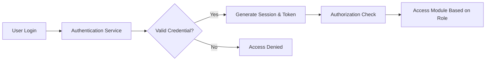

# 4. Manajemen Pendaftaran Pasien

## 4.1 Deskripsi Umum

Modul Manajemen Pendaftaran Pasien merupakan komponen utama dalam Sistem Informasi Rumah Sakit (SIR/HIS) yang berfungsi untuk mengelola proses registrasi pasien secara terintegrasi. Modul ini mendukung proses pendaftaran pasien baru maupun pasien lama, validasi data pasien, pengelolaan nomor rekam medis, serta integrasi dengan modul layanan medis lainnya.

Tujuan utama modul ini adalah:

- Mempercepat proses registrasi pasien.
- Mengurangi duplikasi data pasien.
- Menjamin akurasi dan konsistensi data pasien.
- Mendukung integrasi data antar unit rumah sakit.
- Meningkatkan efisiensi pelayanan administrasi rumah sakit.

---

# 4.2 Alur Pendaftaran Pasien

## 4.2.1 Diagram Alur Registrasi Pasien

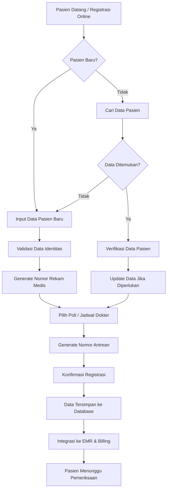

---

## 4.2.2 Penjelasan Alur Registrasi Pasien

| Tahapan | Deskripsi |
|---|---|
| Pasien Datang / Registrasi Online | Pasien dapat melakukan registrasi secara langsung di rumah sakit atau melalui portal online/mobile application. |
| Identifikasi Pasien | Sistem menentukan apakah pasien merupakan pasien baru atau pasien lama berdasarkan nomor identitas atau nomor rekam medis. |
| Input Data Pasien Baru | Petugas registrasi melakukan input data identitas dan informasi dasar pasien apabila pasien belum terdaftar dalam sistem. |
| Pencarian Data Pasien | Untuk pasien lama, sistem melakukan pencarian data berdasarkan NIK, nomor rekam medis, atau nomor telepon. |
| Verifikasi Data Pasien | Sistem meminta konfirmasi data pasien untuk memastikan data masih valid dan terbaru. |
| Validasi Data Identitas | Sistem memvalidasi format dan kelengkapan data pasien seperti NIK, tanggal lahir, nomor BPJS, dan data kontak. |
| Generate Nomor Rekam Medis | Sistem secara otomatis membuat nomor rekam medis unik untuk pasien baru. |
| Update Data Pasien | Petugas dapat memperbarui data pasien apabila terdapat perubahan data. |
| Pemilihan Poli dan Jadwal | Pasien memilih poli tujuan, dokter, serta jadwal pemeriksaan yang tersedia. |
| Generate Nomor Antrean | Sistem membuat nomor antrean berdasarkan poli dan jadwal pemeriksaan. |
| Konfirmasi Registrasi | Sistem menampilkan ringkasan data registrasi sebelum disimpan. |
| Penyimpanan Data | Data pasien dan data registrasi disimpan ke database sistem. |
| Integrasi Modul | Data registrasi dikirim ke modul EMR, billing, laboratorium, dan modul terkait lainnya. |
| Menunggu Pemeriksaan | Pasien masuk ke antrean pelayanan medis sesuai jadwal pemeriksaan. |

---

# 4.3 Pengelolaan Data Pasien

## 4.3.1 Data Pasien yang Dikelola

Sistem mengelola beberapa kategori data pasien sebagai berikut:

| Kategori Data | Informasi |
|---|---|
| Data Identitas | Nama lengkap, NIK, nomor KK, tempat lahir, tanggal lahir, jenis kelamin |
| Data Kontak | Alamat, nomor telepon, email |
| Data Administratif | Nomor rekam medis, nomor BPJS, jenis pembayaran |
| Data Medis Dasar | Golongan darah, alergi, riwayat penyakit |
| Data Penanggung Jawab | Nama keluarga, hubungan keluarga, kontak darurat |
| Data Kunjungan | Riwayat kunjungan, poli tujuan, dokter penanggung jawab |

---

## 4.3.2 Struktur Nomor Rekam Medis

Nomor rekam medis dibuat secara otomatis dan unik untuk setiap pasien.

### Format Nomor Rekam Medis

```text
RM-YYYY-XXXXXX
```

### Contoh

```text
RM-2026-000123
```

Keterangan:

| Komponen | Deskripsi |
|---|---|
| RM | Prefix Rekam Medis |
| YYYY | Tahun registrasi pasien |
| XXXXXX | Nomor urut otomatis sistem |

---

# 4.4 Validasi Data Pasien

Sistem menerapkan validasi data untuk menjaga kualitas dan konsistensi informasi pasien.

## 4.4.1 Validasi Input Data

| Jenis Validasi | Deskripsi |
|---|---|
| Mandatory Field Validation | Memastikan field wajib tidak kosong |
| Format Validation | Memastikan format data sesuai standar |
| Duplicate Validation | Mencegah data pasien ganda |
| Identity Verification | Verifikasi NIK atau nomor identitas |
| Insurance Validation | Validasi nomor BPJS atau asuransi |

---

## 4.4.2 Validasi Data BPJS

Sistem dapat melakukan integrasi dengan layanan BPJS untuk:

- Verifikasi status kepesertaan.
- Validasi nomor kartu BPJS.
- Sinkronisasi data peserta.
- Pembuatan SEP (Surat Eligibilitas Peserta).

---

# 4.5 Keamanan dan Privasi Data Pasien

## 4.5.1 Mekanisme Keamanan

| Mekanisme | Deskripsi |
|---|---|
| Authentication | Validasi login pengguna sistem |
| Authorization | Hak akses berdasarkan role pengguna |
| Audit Log | Pencatatan aktivitas pengguna |
| Data Encryption | Enkripsi data sensitif pasien |
| HTTPS/TLS | Keamanan transmisi data |
| Session Timeout | Logout otomatis ketika tidak aktif |

---

## 4.5.2 Privasi Data Pasien

Sistem menerapkan kebijakan perlindungan data pasien dengan prinsip:

- Confidentiality  
  Data pasien hanya dapat diakses oleh pengguna yang berwenang.

- Integrity  
  Data pasien dijaga agar tidak berubah tanpa izin.

- Availability  
  Data pasien dapat diakses ketika dibutuhkan oleh tenaga medis yang berwenang.

---

# 4.6 Integrasi dengan Modul Lain

Modul pendaftaran pasien terintegrasi dengan beberapa modul lain dalam SIR/HIS.

| Modul | Fungsi Integrasi |
|---|---|
| EMR | Pengiriman data pasien dan rekam medis |
| Billing | Pembuatan tagihan pasien |
| Laboratorium | Pengiriman data pemeriksaan laboratorium |
| Farmasi | Pengelolaan resep dan obat pasien |
| Appointment | Penjadwalan pemeriksaan |
| Notification | Pengiriman notifikasi jadwal dan antrean |

---

# 4.7 Error Handling dan Exception Management

Sistem menyediakan mekanisme penanganan error untuk memastikan proses registrasi berjalan stabil.

| Jenis Error | Penanganan |
|---|---|
| Data Duplikat | Sistem menampilkan notifikasi data pasien sudah tersedia |
| Koneksi Database Gagal | Sistem melakukan retry dan logging error |
| Validasi Gagal | Sistem menampilkan pesan validasi kepada pengguna |
| Integrasi BPJS Gagal | Sistem menyimpan antrean retry integrasi |
| Session Expired | Pengguna diminta login ulang |

---

# 4.8 Audit dan Monitoring

Seluruh aktivitas registrasi pasien dicatat dalam audit log untuk kebutuhan monitoring dan keamanan sistem.

## Data Audit yang Dicatat

| Aktivitas | Informasi Audit |
|---|---|
| Registrasi Pasien | User, timestamp, data yang diinput |
| Update Data Pasien | Perubahan data sebelum dan sesudah |
| Login User | Waktu login dan IP Address |
| Akses Rekam Medis | User dan data yang diakses |

---

# 4.9 Karakteristik Modul

| Karakteristik | Deskripsi |
|---|---|
| Real-Time Processing | Data langsung tersimpan dan tersedia |
| High Availability | Sistem dapat diakses secara kontinu |
| Scalability | Mendukung pertambahan jumlah pasien |
| Data Integrity | Menjamin konsistensi data pasien |
| Security Compliance | Mendukung keamanan data kesehatan |
| Integration Ready | Mendukung integrasi antar sistem |

# 5. Manajemen Rekam Medis

Modul Manajemen Rekam Medis pada Sistem Informasi Rumah Sakit (SIR/HIS) digunakan untuk mengelola seluruh informasi medis pasien secara elektronik dan terintegrasi. Modul ini mendukung proses penyimpanan, pengambilan, pembaruan, dan distribusi data medis pasien kepada unit pelayanan yang berwenang.

Pengelolaan rekam medis dilakukan secara real-time untuk memastikan tenaga medis dapat mengakses informasi pasien dengan cepat, akurat, dan aman.

---

# 5.1 Penyimpanan Rekam Medis

## 5.1.1 Deskripsi Umum

Sistem menyediakan mekanisme penyimpanan rekam medis elektronik (Electronic Medical Record / EMR) yang terpusat untuk seluruh pasien rumah sakit.

Data rekam medis disimpan dalam database terstruktur dan terintegrasi dengan modul lain seperti:

- Modul Registrasi Pasien
- Modul Rawat Jalan
- Modul Rawat Inap
- Modul Laboratorium
- Modul Farmasi
- Modul Billing
- Modul Radiologi

Penyimpanan data dilakukan secara digital untuk mengurangi penggunaan dokumen fisik dan meningkatkan efisiensi akses data medis.

---

## 5.1.2 Jenis Data Rekam Medis

| Jenis Data | Deskripsi |
|---|---|
| Identitas Pasien | Informasi dasar pasien seperti nama, NIK, tanggal lahir, jenis kelamin |
| Riwayat Kunjungan | Data seluruh kunjungan pasien |
| Keluhan Pasien | Keluhan utama pasien saat pemeriksaan |
| Diagnosis | Diagnosis utama dan diagnosis tambahan |
| Tindakan Medis | Tindakan medis yang dilakukan dokter atau perawat |
| Vital Sign | Data tekanan darah, suhu tubuh, denyut nadi, respirasi |
| Resep Obat | Data obat yang diresepkan |
| Hasil Laboratorium | Hasil pemeriksaan laboratorium |
| Hasil Radiologi | Hasil pemeriksaan radiologi |
| Catatan Dokter | Catatan medis dan SOAP note |

---

## 5.1.3 Mekanisme Penyimpanan Data

Sistem menggunakan pendekatan centralized database untuk memastikan seluruh data medis pasien tersimpan secara konsisten dan mudah diakses.

### Mekanisme Penyimpanan

| Komponen | Fungsi |
|---|---|
| Database Server | Menyimpan data rekam medis pasien |
| File Storage | Menyimpan dokumen pendukung dan lampiran |
| Backup Server | Menyimpan data cadangan sistem |
| Audit Log Database | Menyimpan aktivitas pengguna |

---

## 5.1.4 Alur Penyimpanan Rekam Medis

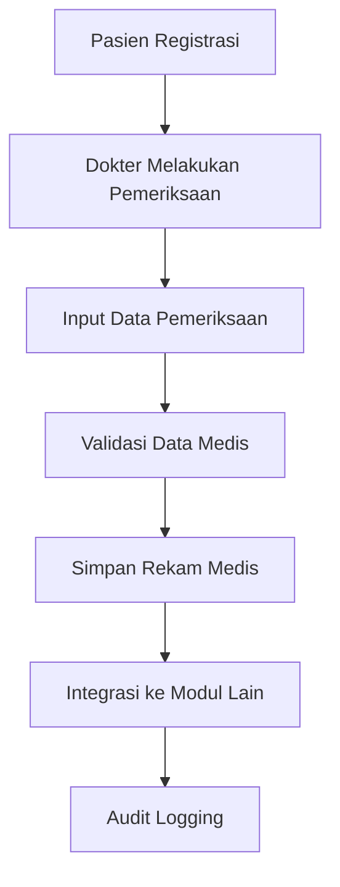

---

## 5.1.5 Keamanan Penyimpanan Rekam Medis

| Mekanisme Keamanan | Deskripsi |
|---|---|
| Authentication | Validasi identitas pengguna |
| Authorization | Hak akses berdasarkan role |
| Data Encryption | Enkripsi data sensitif |
| Audit Logging | Pencatatan aktivitas pengguna |
| Backup Data | Backup berkala data rekam medis |
| Session Timeout | Logout otomatis saat tidak aktif |

---

# 5.2 Riwayat Diagnosis

## 5.2.1 Deskripsi Umum

Sistem menyediakan fitur riwayat diagnosis untuk menyimpan seluruh diagnosis pasien yang dilakukan selama proses pelayanan kesehatan.

Riwayat diagnosis digunakan untuk:

- Membantu dokter dalam analisis kondisi pasien.
- Mengetahui histori penyakit pasien.
- Mendukung pengambilan keputusan medis.
- Mendukung continuity of care pasien.

---

## 5.2.2 Data Diagnosis

| Data Diagnosis | Deskripsi |
|---|---|
| Diagnosis Utama | Penyakit utama pasien |
| Diagnosis Tambahan | Penyakit penyerta atau komplikasi |
| Kode ICD-10 | Kode standar diagnosis |
| Tanggal Diagnosis | Waktu diagnosis dibuat |
| Dokter Penanggung Jawab | Dokter yang melakukan diagnosis |
| Status Diagnosis | Aktif / Selesai |

---

## 5.2.3 Alur Pengelolaan Diagnosis

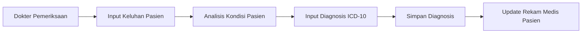

---

## 5.2.4 Histori Diagnosis Pasien

Sistem memungkinkan dokter melihat histori diagnosis pasien sebelumnya untuk mendukung evaluasi medis.

### Informasi Histori Diagnosis

| Informasi | Deskripsi |
|---|---|
| Riwayat Penyakit | Penyakit yang pernah dialami pasien |
| Riwayat Rawat Inap | Data perawatan inap pasien |
| Riwayat Operasi | Riwayat tindakan operasi |
| Riwayat Alergi | Riwayat alergi pasien |
| Riwayat Obat | Histori penggunaan obat |

---

## 5.2.5 Standarisasi Diagnosis

Sistem menggunakan standar internasional untuk menjaga konsistensi data medis.

| Standar | Fungsi |
|---|---|
| ICD-10 | Standar kode diagnosis penyakit |
| ICD-9 CM | Standar kode tindakan medis |

---

# 5.3 Pengelolaan Perawatan dan Obat

## 5.3.1 Deskripsi Umum

Modul Pengelolaan Perawatan dan Obat digunakan untuk mengelola tindakan medis, perawatan pasien, resep obat, serta distribusi obat kepada pasien.

Modul ini terintegrasi dengan:

- Modul Rekam Medis
- Modul Farmasi
- Modul Billing
- Modul Rawat Inap
- Modul Rawat Jalan

---

## 5.3.2 Pengelolaan Tindakan Perawatan

| Jenis Perawatan | Deskripsi |
|---|---|
| Rawat Jalan | Pelayanan pasien tanpa rawat inap |
| Rawat Inap | Pelayanan pasien dengan perawatan inap |
| Tindakan Medis | Pemeriksaan dan tindakan dokter |
| Tindakan Keperawatan | Pelayanan tindakan oleh perawat |
| Operasi | Tindakan bedah pasien |

---

## 5.3.3 Data Tindakan Medis

| Data | Deskripsi |
|---|---|
| ID Tindakan | Identitas tindakan medis |
| Nama Tindakan | Nama prosedur medis |
| Dokter Penanggung Jawab | Dokter pelaksana |
| Tanggal Tindakan | Waktu tindakan dilakukan |
| Status Tindakan | Scheduled / Completed |

---

## 5.3.4 Pengelolaan Resep Obat

Sistem mendukung penggunaan Electronic Prescription (E-Prescription) untuk mempermudah proses pengelolaan obat pasien.

### Fitur Pengelolaan Obat

| Fitur | Deskripsi |
|---|---|
| E-Prescription | Resep elektronik |
| Validasi Dosis | Pemeriksaan dosis obat |
| Allergy Check | Validasi alergi pasien |
| Drug Interaction Check | Validasi interaksi obat |
| Formularium Obat | Daftar obat rumah sakit |

---

## 5.3.5 Alur Pengelolaan Obat

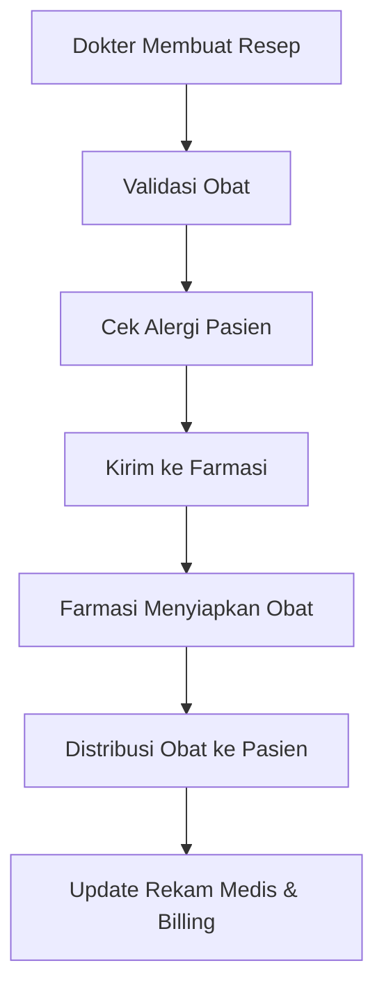

---

## 5.3.6 Monitoring Penggunaan Obat

| Monitoring | Deskripsi |
|---|---|
| Riwayat Resep | Histori resep pasien |
| Monitoring Stok | Monitoring stok obat |
| Obat Kedaluwarsa | Monitoring expired medicine |
| Penggunaan Antibiotik | Monitoring penggunaan antibiotik |

---

# 5.4 Hasil Laboratorium

## 5.4.1 Deskripsi Umum

Modul Hasil Laboratorium digunakan untuk mengelola permintaan pemeriksaan laboratorium dan integrasi hasil pemeriksaan ke dalam rekam medis pasien.

Sistem terintegrasi dengan Laboratory Information System (LIS) untuk mendukung pertukaran data laboratorium secara otomatis dan real-time.

---

## 5.4.2 Jenis Pemeriksaan Laboratorium

| Jenis Pemeriksaan | Deskripsi |
|---|---|
| Hematologi | Pemeriksaan darah |
| Kimia Klinik | Pemeriksaan kimia darah |
| Urinalisa | Pemeriksaan urin |
| Mikrobiologi | Pemeriksaan mikroorganisme |
| Serologi | Pemeriksaan antibodi |
| PCR / Molekuler | Pemeriksaan molekuler |

---

## 5.4.3 Data Hasil Laboratorium

| Data | Deskripsi |
|---|---|
| Nomor Order Lab | Nomor permintaan pemeriksaan |
| Jenis Pemeriksaan | Jenis pemeriksaan laboratorium |
| Hasil Pemeriksaan | Nilai hasil pemeriksaan |
| Nilai Normal | Nilai referensi normal |
| Status Hasil | Pending / Completed |
| Dokter Pengirim | Dokter pengirim pemeriksaan |
| Tanggal Pemeriksaan | Waktu pemeriksaan dilakukan |

---

## 5.4.4 Alur Pemeriksaan Laboratorium

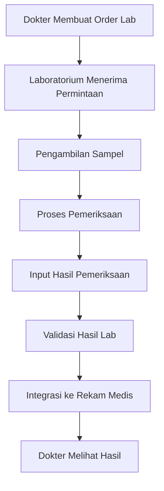

---

## 5.4.5 Integrasi Laboratorium

| Integrasi | Fungsi |
|---|---|
| LIS Integration | Integrasi dengan sistem laboratorium |
| Result Integration | Pengiriman hasil pemeriksaan |
| Critical Alert | Notifikasi hasil kritis |
| Auto Validation | Validasi otomatis hasil pemeriksaan |

---

## 5.4.6 Validasi Hasil Laboratorium

| Validasi | Deskripsi |
|---|---|
| Range Validation | Validasi nilai normal |
| Duplicate Test Validation | Pencegahan pemeriksaan ganda |
| Result Approval | Persetujuan hasil laboratorium |
| Critical Result Validation | Validasi hasil abnormal |

---

## 5.4.7 Keamanan Data Laboratorium

| Mekanisme | Deskripsi |
|---|---|
| Role Based Access | Hak akses berdasarkan role |
| Audit Trail | Pencatatan aktivitas pengguna |
| Data Encryption | Enkripsi hasil laboratorium |
| Secure API | Integrasi aman dengan LIS |

# 6. Penjadwalan dan Janji Temu

## 6.1 Deskripsi Umum

Modul Penjadwalan dan Janji Temu digunakan untuk mengelola proses pemesanan jadwal pelayanan pasien pada Sistem Informasi Rumah Sakit (SIR/HIS). Modul ini mendukung pengelolaan jadwal dokter, pemesanan janji temu pasien, antrean pelayanan, penjadwalan ulang, hingga pembatalan jadwal pemeriksaan.

Modul ini terintegrasi dengan:

- Modul Manajemen Pasien
- Modul Rekam Medis
- Modul Rawat Jalan
- Modul Billing
- Modul Notifikasi
- Modul Dokter dan Jadwal Praktik

Tujuan utama modul ini meliputi:

- Mempermudah proses reservasi layanan pasien.
- Mengurangi antrean manual rumah sakit.
- Meningkatkan efisiensi pelayanan medis.
- Mengoptimalkan jadwal dokter dan ruang pelayanan.
- Mendukung monitoring antrean pasien secara real-time.

---

# 6.2 Penjadwalan Janji Temu

## 6.2.1 Deskripsi Penjadwalan

Sistem menyediakan fitur penjadwalan janji temu untuk pasien rawat jalan maupun konsultasi lanjutan.

Pasien dapat melakukan reservasi melalui:

- Petugas registrasi
- Web portal pasien
- Mobile application
- Self-service kiosk

---

## 6.2.2 Data Penjadwalan

| Data Jadwal | Deskripsi |
|---|---|
| Appointment ID | ID unik janji temu |
| Nomor Rekam Medis | Referensi pasien |
| Nama Pasien | Nama pasien |
| Poli Tujuan | Unit pelayanan tujuan |
| Dokter | Dokter yang dipilih |
| Tanggal Pemeriksaan | Jadwal pemeriksaan |
| Jam Pemeriksaan | Waktu pelayanan |
| Nomor Antrean | Nomor antrean pasien |
| Jenis Kunjungan | Baru / Kontrol |
| Status Appointment | Scheduled / Completed / Cancelled |

---

## 6.2.3 Alur Penjadwalan Janji Temu

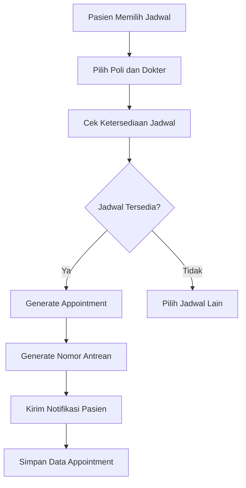

---

## 6.2.4 Penjelasan Alur Penjadwalan

| Tahapan | Deskripsi |
|---|---|
| Pasien Memilih Jadwal | Pasien memilih tanggal pemeriksaan |
| Pilih Poli dan Dokter | Sistem menampilkan daftar dokter dan poli yang tersedia |
| Cek Ketersediaan Jadwal | Sistem memeriksa kapasitas jadwal dokter |
| Generate Appointment | Sistem membuat data janji temu |
| Generate Nomor Antrean | Sistem membuat nomor antrean otomatis |
| Kirim Notifikasi | Sistem mengirimkan detail jadwal kepada pasien |
| Simpan Data Appointment | Data janji temu disimpan ke database |

---

# 6.3 Pengelolaan Jadwal Dokter

## 6.3.1 Deskripsi Umum

Sistem menyediakan fitur pengelolaan jadwal dokter untuk memastikan distribusi jadwal pelayanan berjalan optimal.

Jadwal dokter dapat dikelola oleh administrator atau petugas rumah sakit.

---

## 6.3.2 Data Jadwal Dokter

| Data | Deskripsi |
|---|---|
| Doctor ID | Identitas dokter |
| Nama Dokter | Nama dokter |
| Spesialisasi | Bidang spesialis |
| Hari Praktik | Hari pelayanan |
| Jam Praktik | Waktu pelayanan |
| Kuota Pasien | Kapasitas pasien per jadwal |
| Status Jadwal | Aktif / Nonaktif |

---

## 6.3.3 Fitur Pengelolaan Jadwal

| Fitur | Deskripsi |
|---|---|
| Create Schedule | Membuat jadwal dokter |
| Update Schedule | Mengubah jadwal praktik |
| Disable Schedule | Menonaktifkan jadwal |
| Quota Management | Pengaturan kuota pasien |
| Holiday Management | Pengaturan hari libur |

---

# 6.4 Penjadwalan Ulang (Reschedule)

## 6.4.1 Deskripsi Umum

Sistem mendukung fitur penjadwalan ulang apabila pasien atau dokter tidak dapat hadir sesuai jadwal yang telah ditentukan.

Reschedule dapat dilakukan oleh:

- Pasien
- Petugas registrasi
- Administrator

---

## 6.4.2 Alur Reschedule

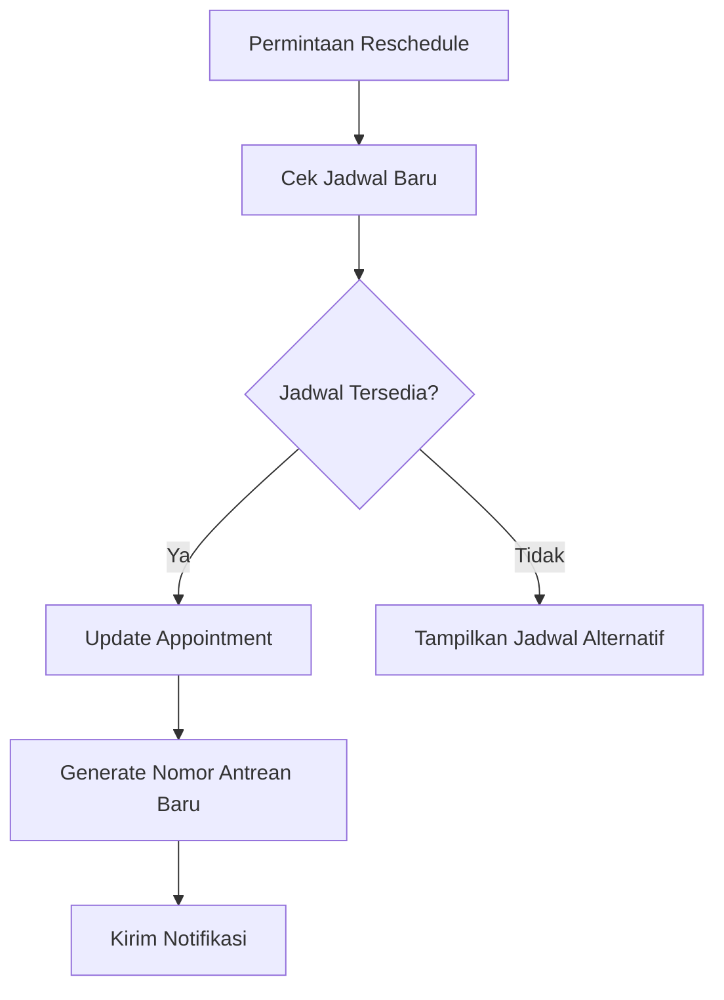

---

## 6.4.3 Aturan Reschedule

| Aturan | Deskripsi |
|---|---|
| Maksimal Reschedule | Maksimal 3 kali perubahan jadwal |
| Batas Waktu | Minimal 1 jam sebelum pemeriksaan |
| Jadwal Alternatif | Menampilkan jadwal dokter lain apabila penuh |
| Notifikasi | Pasien menerima notifikasi perubahan jadwal |

---

# 6.5 Pembatalan Janji Temu

## 6.5.1 Deskripsi Umum

Sistem menyediakan fitur pembatalan janji temu untuk pasien yang tidak dapat hadir atau terdapat perubahan jadwal pelayanan.

Pembatalan dapat dilakukan melalui:

- Portal pasien
- Mobile application
- Petugas registrasi

---

## 6.5.2 Alur Pembatalan Appointment

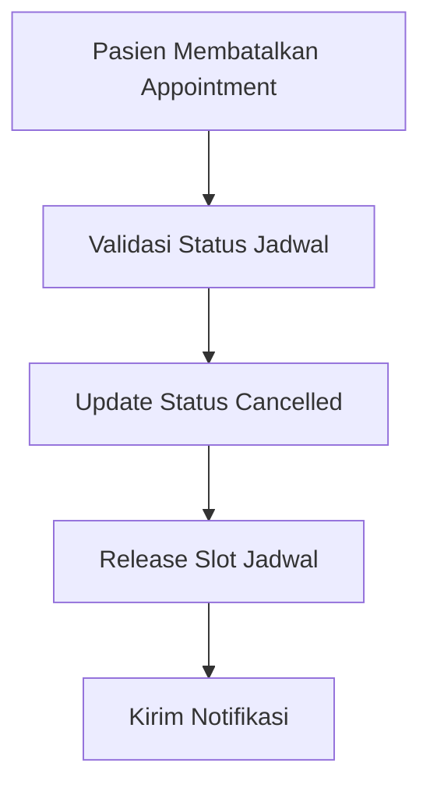

---

## 6.5.3 Status Appointment

| Status | Deskripsi |
|---|---|
| Scheduled | Jadwal aktif |
| Checked-In | Pasien sudah hadir |
| In Progress | Pemeriksaan sedang berlangsung |
| Completed | Pemeriksaan selesai |
| Cancelled | Appointment dibatalkan |
| No Show | Pasien tidak hadir |

---

# 6.6 Manajemen Antrean Pasien

## 6.6.1 Deskripsi Umum

Sistem menyediakan fitur antrean digital untuk membantu pengelolaan pelayanan pasien secara real-time.

Fitur antrean meliputi:

- Nomor antrean otomatis
- Monitoring antrean
- Calling queue system
- Queue dashboard

---

## 6.6.2 Alur Antrean Pasien

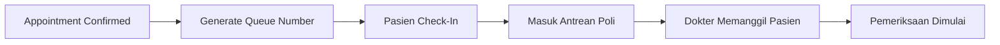

---

## 6.6.3 Data Antrean

| Data | Deskripsi |
|---|---|
| Queue Number | Nomor antrean |
| Poli | Unit pelayanan |
| Dokter | Dokter pemeriksa |
| Estimated Time | Estimasi waktu pelayanan |
| Queue Status | Waiting / Called / Completed |

---

# 6.7 Notifikasi dan Reminder

## 6.7.1 Deskripsi Umum

Sistem menyediakan fitur notifikasi otomatis untuk membantu pasien mengingat jadwal pemeriksaan.

Notifikasi dikirim melalui:

- SMS
- Email
- WhatsApp
- Push Notification

---

## 6.7.2 Jenis Notifikasi

| Jenis Notifikasi | Deskripsi |
|---|---|
| Appointment Confirmation | Konfirmasi jadwal pemeriksaan |
| Reminder H-1 | Pengingat satu hari sebelum pemeriksaan |
| Queue Reminder | Informasi antrean pasien |
| Reschedule Notification | Informasi perubahan jadwal |
| Cancellation Notification | Informasi pembatalan jadwal |

---

# 6.8 Integrasi Modul

## 6.8.1 Integrasi Internal

| Modul | Fungsi Integrasi |
|---|---|
| Manajemen Pasien | Validasi data pasien |
| Rekam Medis | Akses histori pemeriksaan |
| Billing | Pembuatan biaya pemeriksaan |
| Notification | Pengiriman reminder |
| Doctor Management | Pengelolaan jadwal dokter |

---

## 6.8.2 Integrasi Eksternal

| Integrasi | Fungsi |
|---|---|
| BPJS | Integrasi antrean online BPJS |
| SATUSEHAT | Sinkronisasi data layanan |
| SMS Gateway | Pengiriman SMS reminder |
| Email Service | Pengiriman email notifikasi |

---

# 6.9 Keamanan dan Validasi

## 6.9.1 Validasi Jadwal

| Validasi | Deskripsi |
|---|---|
| Schedule Conflict Validation | Pencegahan bentrok jadwal |
| Doctor Availability Check | Validasi ketersediaan dokter |
| Queue Capacity Validation | Validasi kapasitas antrean |
| Duplicate Appointment Validation | Pencegahan appointment ganda |

---

## 6.9.2 Keamanan Sistem

| Mekanisme | Deskripsi |
|---|---|
| Authentication | Validasi pengguna |
| Authorization | Hak akses berdasarkan role |
| Audit Log | Pencatatan aktivitas pengguna |
| Data Encryption | Enkripsi data appointment |
| Secure API | Keamanan komunikasi antar service |

---

# 6.10 Monitoring dan Reporting

## 6.10.1 Monitoring Appointment

| Monitoring | Deskripsi |
|---|---|
| Daily Appointment | Monitoring jumlah appointment harian |
| Queue Monitoring | Monitoring antrean pasien |
| Doctor Schedule Monitoring | Monitoring jadwal dokter |
| No Show Monitoring | Monitoring pasien tidak hadir |

---

## 6.10.2 Reporting

| Report | Deskripsi |
|---|---|
| Appointment Report | Laporan janji temu |
| Queue Report | Laporan antrean pasien |
| Doctor Utilization Report | Pemanfaatan jadwal dokter |
| Cancellation Report | Laporan pembatalan appointment |

---

# 6.11 Karakteristik Modul

| Karakteristik | Deskripsi |
|---|---|
| Real-Time Scheduling | Penjadwalan secara langsung |
| Queue Management | Pengelolaan antrean digital |
| High Availability | Sistem tersedia 24/7 |
| Scalability | Mendukung jumlah appointment besar |
| Integration Ready | Mendukung integrasi eksternal |
| Notification Support | Mendukung reminder otomatis |
| Secure Access | Keamanan data appointment |

# 7. Alur Sistem dan Interaksi

## 7.1 Deskripsi Umum

Alur Sistem dan Interaksi pada Sistem Informasi Rumah Sakit (SIR/HIS) menggambarkan proses interaksi antar pengguna, modul aplikasi, dan layanan sistem dalam menjalankan proses bisnis rumah sakit, khususnya pada modul Manajemen Pasien.

Dokumentasi alur sistem bertujuan untuk:

- Menjelaskan proses bisnis sistem secara menyeluruh.
- Menunjukkan interaksi antar modul dalam sistem.
- Mempermudah proses pengembangan dan integrasi sistem.
- Membantu analisis troubleshooting dan monitoring sistem.
- Mendukung dokumentasi teknis implementasi sistem.

Alur sistem mencakup:

- Registrasi pasien
- Pemeriksaan pasien
- Pengelolaan rekam medis
- Penjadwalan layanan
- Pemeriksaan laboratorium
- Pengelolaan resep obat
- Billing dan pembayaran

---

# 7.2 Alur Registrasi Pasien

## 7.2.1 Deskripsi Alur

Proses registrasi pasien dimulai ketika pasien melakukan pendaftaran ke rumah sakit melalui petugas registrasi, kiosk, mobile application, atau portal pasien.

Sistem akan melakukan validasi data pasien, pembuatan nomor rekam medis, dan integrasi ke modul layanan lainnya.

---

## 7.2.2 Diagram Alur Registrasi Pasien

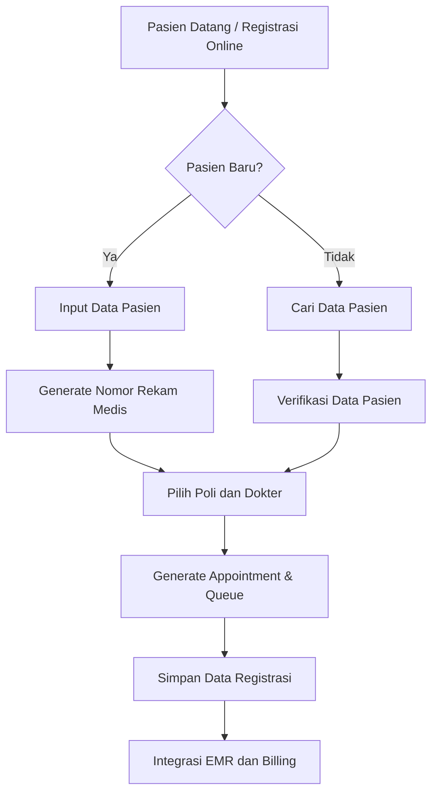

---

## 7.2.3 Penjelasan Alur Registrasi

| Tahapan | Deskripsi |
|---|---|
| Registrasi Pasien | Pasien melakukan pendaftaran layanan |
| Validasi Pasien | Sistem memvalidasi identitas pasien |
| Generate Nomor RM | Sistem membuat nomor rekam medis |
| Pemilihan Poli | Pasien memilih layanan dan dokter |
| Generate Queue | Sistem membuat nomor antrean |
| Simpan Registrasi | Data registrasi disimpan |
| Integrasi Sistem | Data dikirim ke EMR dan billing |

---

# 7.3 Alur Pemeriksaan Pasien

## 7.3.1 Deskripsi Alur

Setelah registrasi selesai, pasien akan masuk ke antrean pemeriksaan sesuai poli dan jadwal dokter.

Dokter dan tenaga medis dapat mengakses data pasien untuk melakukan pemeriksaan dan pengisian rekam medis.

---

## 7.3.2 Diagram Alur Pemeriksaan Pasien

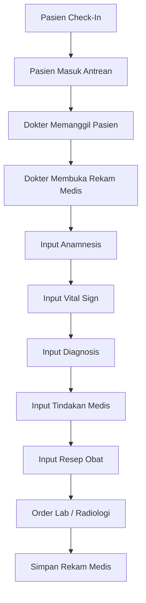

---

## 7.3.3 Penjelasan Alur Pemeriksaan

| Tahapan | Deskripsi |
|---|---|
| Check-In Pasien | Pasien melakukan konfirmasi kehadiran |
| Antrean Pemeriksaan | Pasien masuk antrean poli |
| Pemeriksaan Dokter | Dokter melakukan pemeriksaan pasien |
| Input Rekam Medis | Dokter mengisi data medis pasien |
| Resep dan Tindakan | Dokter membuat resep dan tindakan |
| Pemeriksaan Penunjang | Order laboratorium atau radiologi |
| Penyimpanan Data | Data tersimpan ke EMR |

---

# 7.4 Alur Rekam Medis

## 7.4.1 Deskripsi Alur

Modul Rekam Medis menangani proses penyimpanan, pembaruan, dan pengambilan data medis pasien secara real-time.

Rekam medis dapat diakses oleh dokter, perawat, laboratorium, dan unit terkait sesuai hak akses masing-masing.

---

## 7.4.2 Diagram Alur Rekam Medis

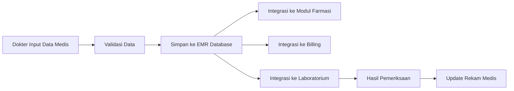

---

## 7.4.3 Penjelasan Alur Rekam Medis

| Tahapan | Deskripsi |
|---|---|
| Input Data Medis | Dokter mengisi data pemeriksaan |
| Validasi Data | Sistem memvalidasi kelengkapan data |
| Simpan EMR | Data disimpan dalam EMR |
| Integrasi Sistem | Data dikirim ke modul lain |
| Update Rekam Medis | Hasil pemeriksaan diperbarui |

---

# 7.5 Alur Pemeriksaan Laboratorium

## 7.5.1 Deskripsi Alur

Pemeriksaan laboratorium dilakukan berdasarkan order dokter yang dikirim melalui sistem.

Hasil laboratorium akan terintegrasi secara otomatis ke rekam medis pasien.

---

## 7.5.2 Diagram Alur Laboratorium

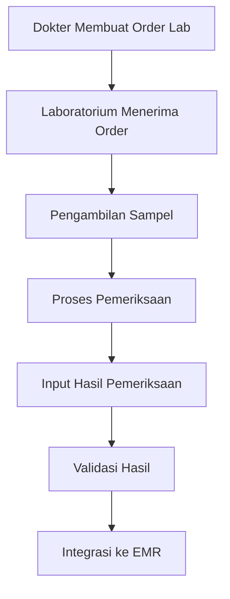

---

## 7.5.3 Penjelasan Alur Laboratorium

| Tahapan | Deskripsi |
|---|---|
| Order Lab | Dokter membuat permintaan pemeriksaan |
| Pengambilan Sampel | Laboratorium mengambil sampel pasien |
| Pemeriksaan Lab | Proses analisis laboratorium |
| Input Hasil | Petugas memasukkan hasil pemeriksaan |
| Integrasi EMR | Hasil terkirim ke rekam medis |

---

# 7.6 Alur Pengelolaan Obat dan Farmasi

## 7.6.1 Deskripsi Alur

Modul farmasi menerima resep elektronik dari dokter dan melakukan proses validasi serta distribusi obat kepada pasien.

---

## 7.6.2 Diagram Alur Farmasi

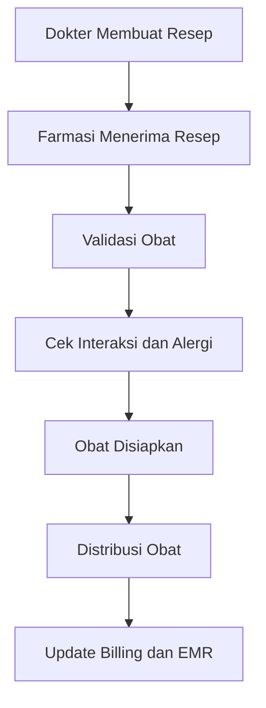

---

## 7.6.3 Penjelasan Alur Farmasi

| Tahapan | Deskripsi |
|---|---|
| Input Resep | Dokter membuat resep elektronik |
| Validasi Obat | Sistem memvalidasi obat |
| Persiapan Obat | Farmasi menyiapkan obat |
| Distribusi Obat | Obat diberikan kepada pasien |
| Update Sistem | Data obat dikirim ke billing dan EMR |

---

# 7.7 Alur Billing dan Pembayaran

## 7.7.1 Deskripsi Alur

Modul billing digunakan untuk mengelola biaya layanan pasien berdasarkan tindakan medis, laboratorium, obat, dan layanan lainnya.

---

## 7.7.2 Diagram Alur Billing

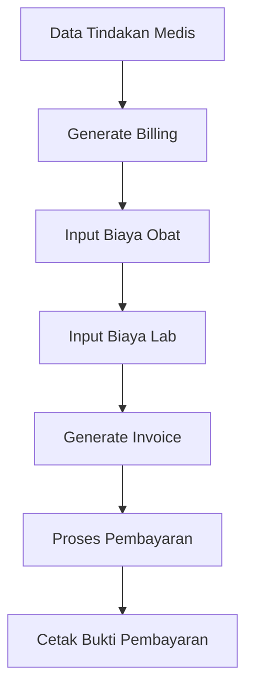

---

## 7.7.3 Penjelasan Alur Billing

| Tahapan | Deskripsi |
|---|---|
| Generate Billing | Sistem membuat tagihan pasien |
| Input Biaya | Sistem menambahkan biaya layanan |
| Generate Invoice | Invoice pembayaran dibuat |
| Pembayaran | Pasien melakukan pembayaran |
| Bukti Pembayaran | Sistem mencetak bukti transaksi |

---

# 7.8 Interaksi Antar Modul

## 7.8.1 Integrasi Internal Sistem

| Modul | Interaksi |
|---|---|
| Registrasi Pasien | Mengirim data pasien ke EMR |
| EMR | Menyimpan data medis pasien |
| Laboratorium | Mengirim hasil pemeriksaan |
| Farmasi | Mengelola resep dan obat |
| Billing | Mengelola transaksi pasien |
| Notification | Mengirim notifikasi layanan |

---

## 7.8.2 Integrasi Eksternal

| Sistem Eksternal | Fungsi |
|---|---|
| BPJS | Verifikasi peserta dan SEP |
| SATUSEHAT | Sinkronisasi data kesehatan |
| LIS | Integrasi laboratorium |
| PACS | Integrasi radiologi |
| Payment Gateway | Pembayaran digital |

---

# 7.9 Sequence Diagram Interaksi Sistem

## 7.9.1 Sequence Diagram Pemeriksaan Pasien

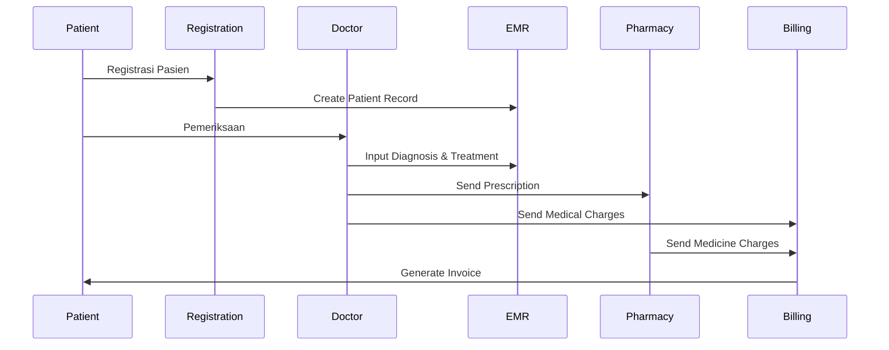

---

# 7.10 Audit dan Monitoring Sistem

## 7.10.1 Audit Log

Sistem mencatat seluruh aktivitas pengguna untuk kebutuhan monitoring dan keamanan.

| Aktivitas | Informasi Audit |
|---|---|
| Login User | User dan waktu login |
| Akses Rekam Medis | Data pasien yang diakses |
| Update Data Medis | Perubahan data medis |
| Generate Billing | Aktivitas transaksi |

---

## 7.10.2 Monitoring Sistem

| Monitoring | Deskripsi |
|---|---|
| API Monitoring | Monitoring request API |
| Database Monitoring | Monitoring performa database |
| Queue Monitoring | Monitoring antrean pasien |
| Error Monitoring | Monitoring error aplikasi |

---

# 7.11 Karakteristik Alur Sistem

| Karakteristik | Deskripsi |
|---|---|
| Real-Time Integration | Integrasi data secara langsung |
| Modular Architecture | Modul dapat dikembangkan independen |
| High Availability | Sistem tersedia 24/7 |
| Scalability | Mendukung pertumbuhan data besar |
| Secure Access | Keamanan akses sistem |
| Auditability | Mendukung audit aktivitas pengguna |

# 8. Keamanan dan Privasi

## 8.1 Keamanan Data

### 8.1.1 Deskripsi Umum

Keamanan data pada Sistem Informasi Rumah Sakit (SIR/HIS) bertujuan untuk melindungi data pasien, rekam medis, data transaksi, dan informasi operasional rumah sakit dari akses tidak sah, kehilangan data, manipulasi data, maupun kebocoran informasi.

Sistem menerapkan berbagai mekanisme keamanan untuk memastikan:

- Kerahasiaan data pasien.
- Integritas data medis.
- Ketersediaan layanan sistem.
- Keamanan komunikasi antar modul.
- Perlindungan data sensitif pasien.

---

### 8.1.2 Jenis Data yang Diamankan

| Jenis Data | Deskripsi |
|---|---|
| Data Pasien | Identitas dan informasi pasien |
| Rekam Medis | Riwayat medis dan diagnosis pasien |
| Data Pembayaran | Informasi billing dan transaksi |
| Data Laboratorium | Hasil pemeriksaan laboratorium |
| Data User | Informasi akun pengguna sistem |
| Data Audit | Aktivitas pengguna sistem |

---

### 8.1.3 Mekanisme Keamanan Data

| Mekanisme | Deskripsi |
|---|---|
| Authentication | Validasi identitas pengguna sebelum login |
| Authorization | Pembatasan akses berdasarkan role pengguna |
| Data Encryption | Enkripsi data sensitif pasien |
| Secure Communication | Pengamanan komunikasi antar service |
| Session Management | Pengelolaan sesi login pengguna |
| Backup Data | Backup data berkala |

---

### 8.1.4 Authentication

Sistem menggunakan mekanisme autentikasi untuk memastikan hanya pengguna yang valid yang dapat mengakses aplikasi.

#### Fitur Authentication

| Fitur | Deskripsi |
|---|---|
| Username & Password | Login menggunakan akun pengguna |
| Password Hashing | Password disimpan dalam bentuk terenkripsi |
| Multi-Factor Authentication | Verifikasi tambahan menggunakan OTP |
| Session Timeout | Logout otomatis ketika idle |
| Failed Login Protection | Pembatasan percobaan login gagal |

---

### 8.1.5 Data Encryption

Sistem menerapkan enkripsi data untuk melindungi informasi sensitif pasien.

| Jenis Enkripsi | Fungsi |
|---|---|
| Encryption at Rest | Enkripsi data pada database |
| Encryption in Transit | Enkripsi komunikasi data |
| TLS/HTTPS | Pengamanan komunikasi web |
| Secure API | Pengamanan komunikasi antar service |

---

### 8.1.6 Backup dan Recovery

Sistem menyediakan mekanisme backup dan recovery untuk menjaga ketersediaan data.

| Mekanisme | Deskripsi |
|---|---|
| Full Backup | Backup seluruh database |
| Incremental Backup | Backup perubahan data |
| Scheduled Backup | Backup otomatis berkala |
| Disaster Recovery | Pemulihan layanan ketika terjadi gangguan |

---

## 8.2 Kontrol Akses

### 8.2.1 Deskripsi Umum

Kontrol akses digunakan untuk membatasi hak akses pengguna berdasarkan peran dan tanggung jawab masing-masing pengguna dalam sistem.

Sistem menerapkan Role Based Access Control (RBAC) untuk memastikan pengguna hanya dapat mengakses fitur dan data yang sesuai dengan hak aksesnya.

---

### 8.2.2 Role Pengguna

| Role | Deskripsi |
|---|---|
| Administrator | Mengelola seluruh konfigurasi sistem |
| Dokter | Mengakses rekam medis dan diagnosis pasien |
| Perawat | Mengakses data perawatan pasien |
| Petugas Registrasi | Mengelola registrasi pasien |
| Laboratorium | Mengelola pemeriksaan laboratorium |
| Apoteker | Mengelola resep dan distribusi obat |
| Billing Staff | Mengelola transaksi pembayaran |
| Pasien | Mengakses portal pasien |

---

### 8.2.3 Matriks Hak Akses

| Modul | Admin | Dokter | Perawat | Registrasi | Lab | Farmasi | Billing |
|---|---|---|---|---|---|---|---|
| Data Pasien | CRUD | R | R | CRU | R | R | R |
| Rekam Medis | CRUD | CRU | R | - | - | - | - |
| Diagnosis | CRUD | CRU | R | - | - | - | - |
| Laboratorium | CRUD | R | R | - | CRU | - | - |
| Farmasi | CRUD | R | R | - | - | CRU | - |
| Billing | CRUD | R | - | - | - | - | CRU |
| User Management | CRUD | - | - | - | - | - | - |

Keterangan:

- C = Create
- R = Read
- U = Update
- D = Delete

---

### 8.2.4 Mekanisme Kontrol Akses

| Mekanisme | Deskripsi |
|---|---|
| Role Based Access Control | Hak akses berdasarkan role |
| Permission Validation | Validasi permission setiap request |
| Session Validation | Validasi sesi login |
| Access Token Validation | Validasi token akses API |
| IP Restriction | Pembatasan akses berdasarkan jaringan |

---

### 8.2.5 Alur Validasi Akses

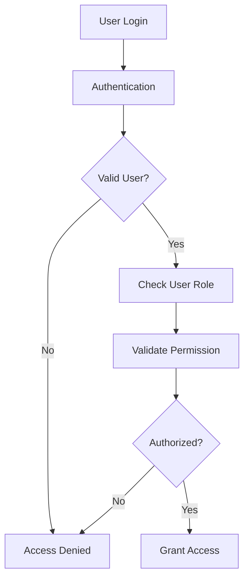

---

## 8.3 Audit Log

### 8.3.1 Deskripsi Umum

Audit log digunakan untuk mencatat seluruh aktivitas pengguna dalam sistem guna mendukung monitoring, keamanan, troubleshooting, dan kebutuhan audit.

Setiap aktivitas penting yang dilakukan pengguna akan disimpan secara otomatis oleh sistem.

---

### 8.3.2 Aktivitas yang Dicatat

| Aktivitas | Informasi Audit |
|---|---|
| Login User | User ID, waktu login, IP Address |
| Logout User | Waktu logout |
| Registrasi Pasien | Data pasien yang dibuat |
| Update Rekam Medis | Perubahan data medis |
| Input Diagnosis | Diagnosis yang dibuat dokter |
| Input Resep | Aktivitas pembuatan resep |
| Generate Billing | Aktivitas transaksi pembayaran |
| Akses Rekam Medis | Data pasien yang diakses |

---

### 8.3.3 Struktur Data Audit Log

| Field | Deskripsi |
|---|---|
| Audit ID | ID unik audit |
| User ID | Pengguna yang melakukan aktivitas |
| Activity Type | Jenis aktivitas |
| Module | Modul sistem terkait |
| Timestamp | Waktu aktivitas |
| IP Address | IP pengguna |
| Before Data | Data sebelum perubahan |
| After Data | Data sesudah perubahan |

---

### 8.3.4 Alur Audit Logging

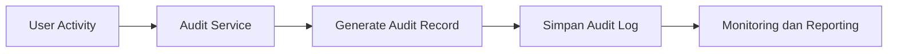

---

### 8.3.5 Monitoring Audit Log

| Monitoring | Deskripsi |
|---|---|
| Login Monitoring | Monitoring aktivitas login |
| Failed Login Monitoring | Monitoring login gagal |
| Sensitive Data Access | Monitoring akses data sensitif |
| User Activity Monitoring | Monitoring aktivitas pengguna |
| Security Incident Monitoring | Monitoring insiden keamanan |

---

### 8.3.6 Retensi Audit Log

| Jenis Log | Masa Retensi |
|---|---|
| Login Activity | Minimal 1 Tahun |
| Data Modification Log | Minimal 2 Tahun |
| Security Log | Minimal 2 Tahun |
| Transaction Log | Minimal 5 Tahun |

---

### 8.3.7 Keamanan Audit Log

| Mekanisme | Deskripsi |
|---|---|
| Immutable Log | Log tidak dapat diubah |
| Log Encryption | Enkripsi data audit |
| Restricted Access | Akses terbatas pada administrator |
| Backup Audit Log | Backup berkala audit log |

# 9. Skalabilitas dan Kegunaan

## 9.1 Skalabilitas Sistem

### 9.1.1 Deskripsi Umum

Sistem Informasi Rumah Sakit (SIR/HIS) dirancang menggunakan arsitektur modular dan scalable untuk mendukung peningkatan jumlah pengguna, transaksi, dan data medis seiring pertumbuhan operasional rumah sakit.

Sistem harus mampu menangani:

- Peningkatan jumlah pasien
- Akses multi-user secara bersamaan
- Pertumbuhan data rekam medis
- Integrasi antar modul dan layanan eksternal

---

### 9.1.2 Strategi Skalabilitas

| Strategi | Deskripsi |
|---|---|
| Horizontal Scaling | Penambahan instance application server |
| Load Balancing | Distribusi trafik aplikasi |
| Database Replication | Replikasi database untuk availability |
| Modular Service | Pemisahan service berdasarkan modul |
| Queue Processing | Pemrosesan asynchronous untuk transaksi besar |

---

### 9.1.3 Arsitektur Skalabilitas

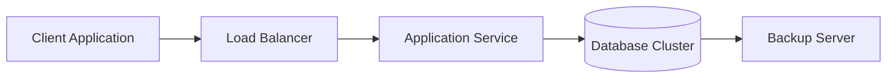

---

## 9.2 Performa Sistem

### 9.2.1 Deskripsi Umum

Sistem dirancang untuk memberikan performa yang stabil dan responsif guna mendukung operasional rumah sakit secara real-time.

---

### 9.2.2 Target Performa

| Parameter | Target |
|---|---|
| Response Time | < 3 Detik |
| API Response | < 2 Detik |
| Concurrent User | > 1000 User |
| System Availability | 99.9% |

---

### 9.2.3 Optimasi Performa

| Optimasi | Deskripsi |
|---|---|
| Database Indexing | Optimasi query database |
| Caching | Penyimpanan data sementara |
| Asynchronous Process | Pemrosesan background task |
| Connection Pooling | Optimasi koneksi database |
| Monitoring Service | Monitoring performa aplikasi |

# 10. Integrasi dan Pengembangan

## 10.1 Integrasi Antar Modul

### 10.1.1 Deskripsi Umum

Sistem Informasi Rumah Sakit (SIR/HIS) menggunakan mekanisme integrasi antar modul untuk memastikan pertukaran data berjalan secara real-time dan konsisten antar layanan rumah sakit.

Integrasi dilakukan untuk mendukung sinkronisasi data pasien, rekam medis, laboratorium, farmasi, billing, dan layanan lainnya.

---

### 10.1.2 Modul yang Terintegrasi

| Modul | Fungsi Integrasi |
|---|---|
| Registrasi Pasien | Pengiriman data pasien |
| Rekam Medis | Penyimpanan data medis pasien |
| Laboratorium | Pengiriman hasil pemeriksaan |
| Farmasi | Pengelolaan resep dan obat |
| Billing | Pengelolaan transaksi pasien |
| Appointment | Pengelolaan jadwal dan antrean |
| Notification | Pengiriman notifikasi sistem |

---

### 10.1.3 Alur Integrasi Antar Modul

```mermaid
flowchart LR

A[Registrasi Pasien] --> B[Rekam Medis]

B --> C[Laboratorium]

B --> D[Farmasi]

B --> E[Billing]

E --> F[Notification]
```

---

## 10.2 API dan Middleware

### 10.2.1 Deskripsi Umum

Sistem menyediakan API dan middleware sebagai media komunikasi antar modul internal maupun integrasi dengan sistem eksternal.

API digunakan untuk pertukaran data secara real-time menggunakan protokol HTTP/HTTPS dan format JSON.

---

### 10.2.2 Arsitektur API

| Komponen | Fungsi |
|---|---|
| API Gateway | Pengelolaan request API |
| Authentication Service | Validasi token dan autentikasi |
| Middleware Service | Penghubung antar modul |
| Integration Service | Integrasi dengan sistem eksternal |
| Logging Service | Monitoring request API |

---

### 10.2.3 Jenis API

| API | Fungsi |
|---|---|
| Patient API | Pengelolaan data pasien |
| EMR API | Pengelolaan rekam medis |
| Laboratory API | Integrasi laboratorium |
| Pharmacy API | Pengelolaan resep dan obat |
| Billing API | Pengelolaan transaksi |
| Appointment API | Pengelolaan jadwal pasien |

---

### 10.2.4 Alur API dan Middleware

```mermaid
flowchart TD

A[Client Application] --> B[API Gateway]

B --> C[Authentication Service]

C --> D[Middleware Service]

D --> E[Application Module]

E --> F[(Database)]
```

---

### 10.2.5 Standar Integrasi

| Standar | Fungsi |
|---|---|
| REST API | Komunikasi antar service |
| JSON | Format pertukaran data |
| HTTPS | Keamanan komunikasi data |
| JWT Token | Authentication dan authorization |
| HL7/FHIR | Standar integrasi data kesehatan |

---

## 10.3 Pengembangan Sistem

### 10.3.1 Deskripsi Umum

Pengembangan Sistem Informasi Rumah Sakit dilakukan menggunakan pendekatan modular untuk mempermudah maintenance, scalability, dan pengembangan fitur baru.

Pengembangan sistem mendukung implementasi bertahap sesuai kebutuhan operasional rumah sakit.

---

### 10.3.2 Metodologi Pengembangan

| Metodologi | Deskripsi |
|---|---|
| Agile Development | Pengembangan iteratif dan bertahap |
| Modular Development | Pengembangan berdasarkan modul |
| Version Control | Pengelolaan source code |
| Continuous Integration | Integrasi perubahan kode otomatis |
| Continuous Deployment | Deployment aplikasi otomatis |

---

### 10.3.3 Struktur Pengembangan Sistem

| Layer | Fungsi |
|---|---|
| Frontend Layer | Antarmuka pengguna |
| Backend Service | Proses bisnis aplikasi |
| API Layer | Komunikasi antar service |
| Database Layer | Penyimpanan data |
| Integration Layer | Integrasi eksternal |

---

### 10.3.4 Alur Pengembangan Sistem

```mermaid
flowchart LR

A[Requirement Analysis] --> B[System Design]

B --> C[Development]

C --> D[Testing]

D --> E[Deployment]

E --> F[Monitoring & Maintenance]
```

---

### 10.3.5 Environment Pengembangan

| Environment | Fungsi |
|---|---|
| Development | Pengembangan aplikasi |
| Testing | Pengujian sistem |
| Staging | Simulasi production |
| Production | Sistem operasional rumah sakit |

---

### 10.3.6 Monitoring dan Maintenance

| Aktivitas | Deskripsi |
|---|---|
| System Monitoring | Monitoring performa sistem |
| Bug Fixing | Perbaikan error aplikasi |
| Security Update | Pembaruan keamanan sistem |
| Backup Monitoring | Monitoring backup data |
| Performance Optimization | Optimasi performa aplikasi |

# 11. Tinjauan dan Umpan Balik

## 11.1 Review Teknis

### 11.1.1 Deskripsi Umum

Review teknis dilakukan untuk memastikan Sistem Informasi Rumah Sakit (SIR/HIS) telah memenuhi kebutuhan fungsional, performa, keamanan, dan integrasi sistem sesuai spesifikasi teknis yang telah ditentukan.

Review dilakukan secara berkala selama proses pengembangan dan implementasi sistem.

---

### 11.1.2 Ruang Lingkup Review Teknis

| Area Review | Deskripsi |
|---|---|
| Arsitektur Sistem | Evaluasi desain dan struktur sistem |
| Integrasi Sistem | Validasi integrasi antar modul |
| Database | Review struktur dan performa database |
| API Service | Validasi komunikasi API |
| Keamanan Sistem | Evaluasi authentication dan authorization |
| Performa Sistem | Pengujian response time dan stability |

---

### 11.1.3 Proses Review Teknis

```mermaid
flowchart LR

A[Technical Review] --> B[Issue Identification]

B --> C[Improvement Recommendation]

C --> D[System Revision]

D --> E[Re-Testing]
```

---

### 11.1.4 Hasil Review Teknis

| Hasil Review | Tindak Lanjut |
|---|---|
| Performance Issue | Optimasi query dan service |
| Security Gap | Perbaikan mekanisme keamanan |
| Integration Error | Perbaikan API dan middleware |
| UI/UX Issue | Penyempurnaan tampilan sistem |

---

## 11.2 Review Pengguna

### 11.2.1 Deskripsi Umum

Review pengguna dilakukan untuk mengevaluasi kemudahan penggunaan sistem, kesesuaian proses bisnis, dan efektivitas fitur yang digunakan oleh pengguna rumah sakit.

Review dilakukan oleh:

- Dokter
- Perawat
- Petugas Registrasi
- Laboratorium
- Farmasi
- Billing Staff
- Administrator

---

### 11.2.2 Aspek Review Pengguna

| Aspek | Deskripsi |
|---|---|
| Kemudahan Penggunaan | Evaluasi usability sistem |
| Kecepatan Sistem | Evaluasi performa aplikasi |
| Kesesuaian Fitur | Evaluasi kebutuhan operasional |
| Stabilitas Sistem | Evaluasi reliability aplikasi |
| Tampilan Sistem | Evaluasi UI/UX aplikasi |

---

### 11.2.3 Alur Review Pengguna

```mermaid
flowchart TD

A[User Feedback] --> B[Feedback Collection]

B --> C[Analysis]

C --> D[Improvement Planning]

D --> E[System Enhancement]
```

---

### 11.2.4 Metode Pengumpulan Feedback

| Metode | Deskripsi |
|---|---|
| User Interview | Wawancara pengguna |
| Questionnaire | Kuesioner pengguna |
| System Monitoring | Monitoring aktivitas pengguna |
| Helpdesk Ticket | Laporan kendala pengguna |
| UAT Session | User Acceptance Testing |

---

## 11.3 Rencana Peningkatan

### 11.3.1 Deskripsi Umum

Rencana peningkatan sistem dilakukan untuk mendukung pengembangan fitur baru, peningkatan performa, keamanan sistem, dan penyesuaian kebutuhan operasional rumah sakit.

---

### 11.3.2 Area Peningkatan Sistem

| Area | Rencana Peningkatan |
|---|---|
| Performa Sistem | Optimasi response time |
| Keamanan Sistem | Penambahan MFA dan security monitoring |
| Integrasi Sistem | Penambahan integrasi layanan eksternal |
| User Experience | Penyempurnaan tampilan aplikasi |
| Reporting | Pengembangan dashboard dan analytics |

---

### 11.3.3 Prioritas Pengembangan

| Prioritas | Deskripsi |
|---|---|
| High Priority | Bug fixing dan security issue |
| Medium Priority | Optimasi performa sistem |
| Low Priority | Pengembangan fitur tambahan |

---

### 11.3.4 Alur Peningkatan Sistem

```mermaid
flowchart LR

A[Feedback & Review] --> B[Requirement Analysis]

B --> C[Development Planning]

C --> D[Implementation]

D --> E[Testing & Deployment]
```

---

### 11.3.5 Monitoring Peningkatan Sistem

| Monitoring | Deskripsi |
|---|---|
| System Performance | Monitoring performa aplikasi |
| User Satisfaction | Monitoring kepuasan pengguna |
| Security Monitoring | Monitoring keamanan sistem |
| Error Monitoring | Monitoring error aplikasi |
| Feature Usage | Monitoring penggunaan fitur |
